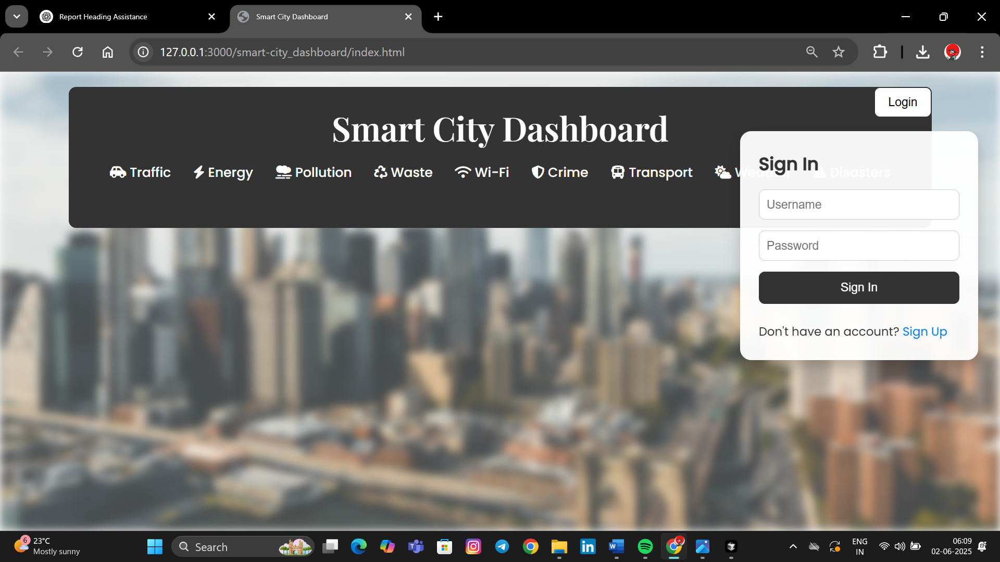
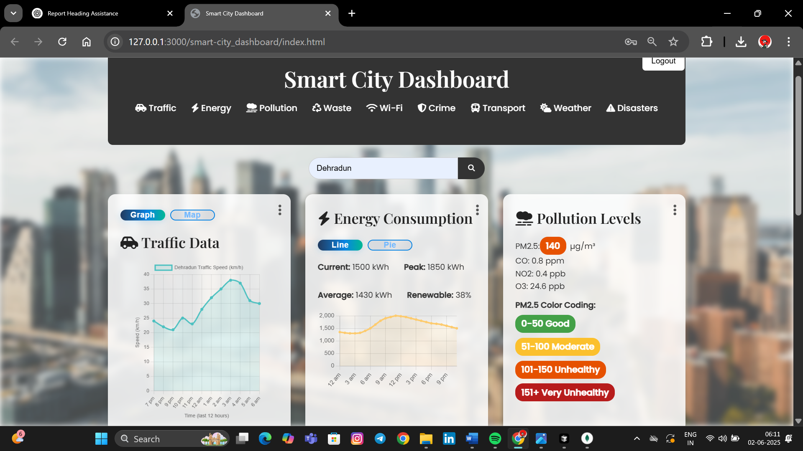
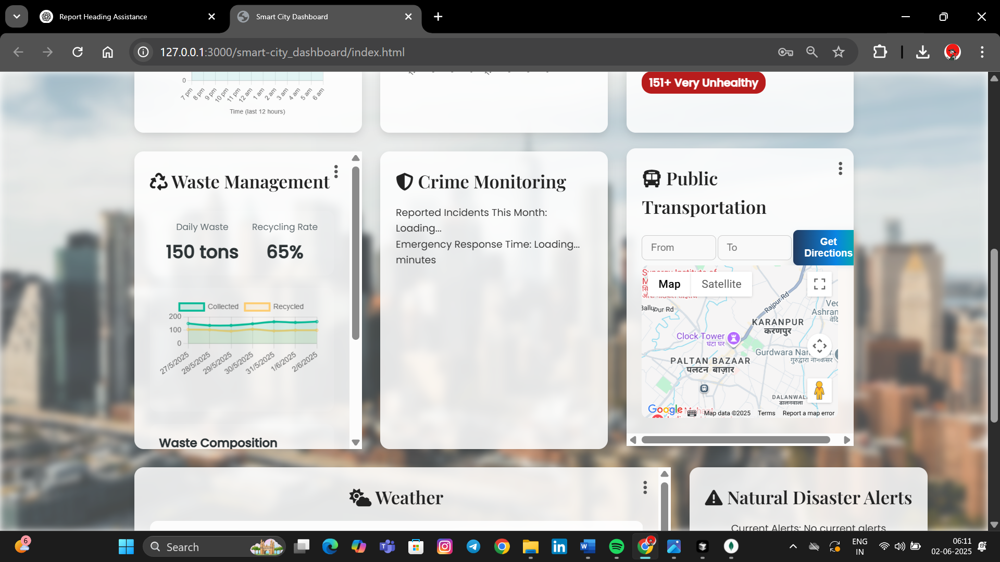
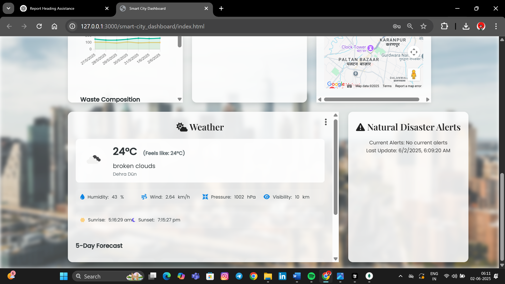

# 🌆 SmartCity Dashboard

A full-stack Smart City Dashboard web application that visualizes and monitors key urban metrics such as traffic, pollution, weather, and energy data.

## 🚀 Tech Stack

- 🧑‍💻 **Frontend**: HTML, CSS, JavaScript  
- 🧰 **Backend**: Node.js, Express.js  
- 🛢️ **Database**: MongoDB (for user authentication and data storage)  
- 🌐 **APIs Used**: TomTom, IQAir (AirVisual), OpenWeatherMap

## 📸 Features

- 🧭 Real-time city metric visualization
- 🔐 User authentication using MongoDB
- 🌐 Responsive and intuitive user interface
- 📡 Modular backend API with Express.js
- 🌦️ Displays live weather and pollution information (API-based)

## 📁 Folder Structure
```
SmartCityDashboard/
├── backend/ # Express.js backend
│ ├── routes/ # API routes
│ ├── models/ # MongoDB data models
│ └── server.js # Entry point
├── frontend/ # HTML, CSS, JS files
│ ├── index.html
│ ├── style.css
│ └── script.js
└── README.md
```

## 🔍 Overview

A modern, real-time Smart City Dashboard that tracks and displays key urban metrics like:

-->🛣️ Traffic Flow

-->🌫️ Air Pollution

-->☀️ Weather Conditions

-->🚮 Waste Management

-->⚡ Energy Usage

## 📸 Dashboard Screenshots


-----------------------------------------------------------------------------------------------------------------------------------


-----------------------------------------------------------------------------------------------------------------------------------


-----------------------------------------------------------------------------------------------------------------------------------


-----------------------------------------------------------------------------------------------------------------------------------


## 🛠️ How to Run the Project Locally

### 1. Clone the Repository

```bash
git clone https://github.com/your-username/SmartCityDashboard.git
cd SmartCityDashboard
```
### 👉 Or Download as ZIP
**If you're not familiar with Git, you can also:**
```
1. Go to https://github.com/your-username/SmartCityDashboard

2. Click the green "Code" button

3. Select "Download ZIP"

4. Extract the ZIP file on your system

5. Open the folder using your code editor or terminal
```
### 2. 🔐 API Keys
To enable features like weather updates, pollution data, or any other third-party services, you'll need to obtain and add the required API keys.
_📋 Steps:_
#### (1). TomTom API Key
**-Go to TomTom Developer Portal**

-[Get it HERE](https://developer.tomtom.com)
**-Sign Up / Log In**

      → Use your email, Google, or GitHub account.
**-Create a New Project / App**

      -Click "Add a new app" in your dashboard.
      -Enter app name (e.g., SmartCityDashboard) and optional description.
**-Copy the Generated API Key**

      -After app creation, you'll get an API key.
      -Click "Copy" to save it for use.
**-Use the API Key in Your Code**
Done! You can now use TomTom services in your app.
#### (2). AIRVisual API Key
-[Get It Here](https://www.iqair.com/world-air-quality-api)
       --> Done Same Thing for it and generate api key 🗝 

#### (3). [OpenWeatherMap API Key]
-[Get it here](https://home.openweathermap.org/api_keys )
      --> Done Same Thing for it and generate api key 🗝
#### (4). Add Required API's as above.........


### 3. 🍃MongoDB Configuration


This project uses MongoDB as its database. Follow these steps to set up MongoDB:

1. **Install MongoDB**  
   - Download and install MongoDB from [mongodb.com](https://www.mongodb.com/try/download/community) or use [MongoDB Atlas](https://www.mongodb.com/cloud/atlas) for a cloud database.

2. **Start MongoDB**  
   - If running locally, start the MongoDB server:
     ```sh
     mongod
     ```
   - For Atlas, create a cluster and get your connection string.

3. **Install Dependencies**  
   - In the `pollution-proxy` directory, install the MongoDB driver:
     ```sh
     npm install mongodb
     ```

4. **Configure the Connection**  
   - Set your MongoDB URI in a `.env` file or directly in your code:
     ```
     MONGODB_URI=mongodb://localhost:27017
     ```
   - (Optional) Install `dotenv` to load environment variables:
     ```sh
     npm install dotenv
     ```

5. **Usage in Code**  
   - The code connects to MongoDB to store and retrieve data related to pollution, transport, waste, and weather.  
   - Example connection snippet:
     ```js
     const { MongoClient } = require('mongodb');
     const uri = process.env.MONGODB_URI || 'mongodb://localhost:27017';
     const client = new MongoClient(uri);
     ```

6. **Run the Project**  
   - Start your Node.js server (e.g., in `pollution-proxy/`):
     ```sh
     node index.js
     ```

**Note:**  
- Make sure MongoDB is running before starting the server.
- Update the MongoDB URI as needed for your environment.

### 4. ⚙️ Node.js And Express.js
```
**❓ Why Use Node.js and Express.js?**
    -->Why Node.js?
-Node.js is a JavaScript runtime that lets you run JavaScript code on the server (outside the browser).
-It’s fast, efficient, and great for building scalable network applications.
-In our project, Node.js runs the backend server that handles API requests, connects to MongoDB, and serves data to your frontend.
    -->Why Express.js?
-Express.js is a web framework for Node.js.
-It simplifies building web servers and APIs by providing easy-to-use routing, middleware, and request/response handling.
-In your project, Express.js is used to define API endpoints (like /api/auth, /api/weather, etc.) and handle HTTP requests.
```
--------------------------------------------------------------------------------------------------------------------------------------
**🔌 INSTALLATION PROCESS**
1. Install Node.js
-Download and install Node.js from the official website.
-After installation, check the version in your terminal:
```
  node -v
  npm -v
```
2. Initialize Your Project (if not already done)
-In your project directory (e.g., pollution-proxy/index.js), run:
```
npm init -y
```
(This creates a package.json file to manage dependencies.)

3. Install Express.js
-In the same directory, install Express.js:
```
  npm install express
```
4. Install Other Useful Packages
-For your project, you may also need:
```
  npm install mongoose bcrypt cors node-fetch express-rate-limit
```
--------------------------------------------------------------------------------------------------------------------------------------
#### How to Use Node.js and Express.js in This Project 
-The backend code (in pollution-proxy/) uses Node.js to run the server and Express.js to define API routes.
-▶️ Start the server with:
```
  node index.js
```
-The server will listen for requests (e.g., from your frontend or tools like Postman) and respond with data or perform actions (like user authentication).

**Summary:**
```
-Node.js runs your backend JavaScript code.
-Express.js makes it easy to build APIs and handle web requests.
-Both are essential for your project’s backend.
```
--------------------------------------------------------------------------------------------------------------------------------------

##### Now you successfully install backend server and mongodb and their dependencies....Now go to pollution proxy folder and on (index.js) in their terminal write :
```
F:\Smartcity2\smart-city_dashboard\pollution-proxy> node index.js
```
▶️ In Teminal:(After start backend server,this will be shown in terminal).
```
Server running at http://localhost:3002
Routes registered:
- /api/weather
- /api/waste
- /api/transport
- /api/disasters
- /api/auth
OpenWeatherMap API key is valid.
```
###### **Now everything is workng well ,now go to (index.html) go to dashboard signup or login and use the dashboard.....**
--------------------------------------------------------------------------------------------------------------------------------------
